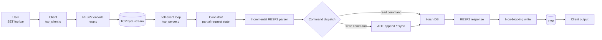
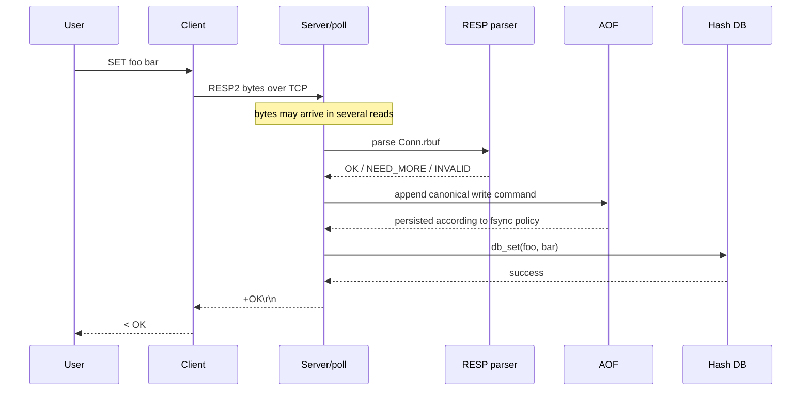
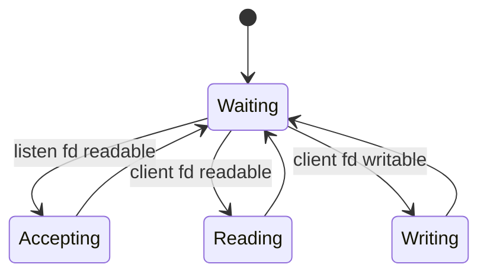
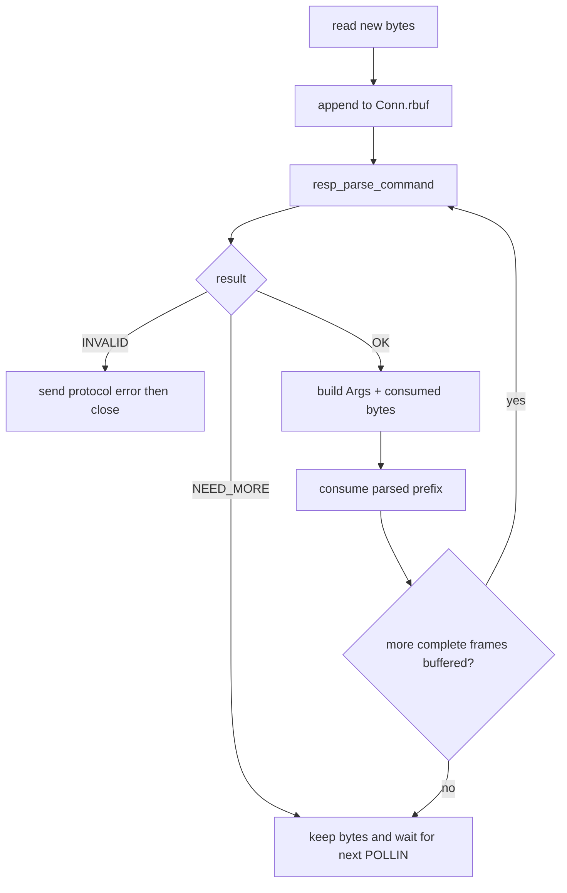
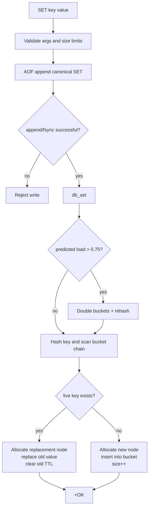
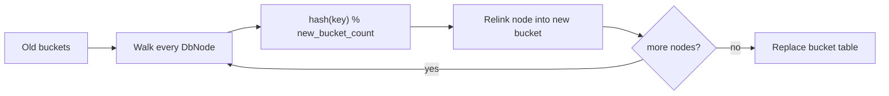
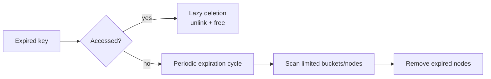
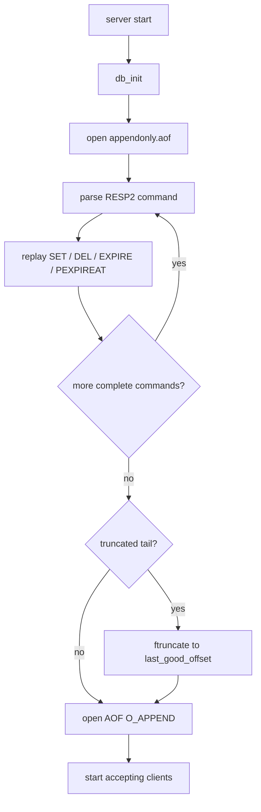

# mini-redis-c

> A Redis-like, single-threaded in-memory KV server written in C — built around **RESP2 + non-blocking TCP + poll + hash table + TTL + AOF**.

<p align="center">
  <strong>Client → RESP2 → TCP → poll event loop → command dispatch → Hash DB / AOF → RESP2 response</strong>
</p>

---

## Project at a glance

| Area | Current implementation |
|---|---|
| **Networking** | TCP server/client, IPv4, non-blocking sockets |
| **Event loop** | Single-threaded `poll`, up to 1024 connection slots |
| **Protocol** | RESP2 basic types + command arrays |
| **Storage** | Custom hash table + separate chaining |
| **Scaling** | Load-factor-triggered one-shot rehash |
| **Commands** | `SET GET DEL EXISTS EXPIRE PEXPIREAT TTL PTTL` + utility commands |
| **Expiration** | Lazy deletion + budgeted periodic scan |
| **Persistence** | AOF append + fsync policy + replay + tail repair + synchronous rewrite |
| **Safety limits** | Frame / bulk / key / value / nesting limits |
| **Verification** | Integration test, sanitizer run, latency/recovery/memory tools |

> **Scope:** this is a learning-oriented Redis-like server, not a production Redis replacement. The README intentionally separates **implemented behavior** from **future work**.

---

# 1. System picture



### One `SET foo bar` request, end to end



---

# 2. What is implemented

## Core command set

| Category | Commands |
|---|---|
| Connectivity | `PING [message]`, `ECHO message`, `QUIT` |
| String KV | `SET key value`, `GET key` |
| Key operations | `DEL key`, `EXISTS key`, `DBSIZE` |
| Expiration | `EXPIRE key seconds`, `PEXPIREAT key unix_ms`, `TTL key`, `PTTL key` |
| Persistence | `AOFREWRITE` |
| Introspection | `INFO` |
| Basic client compatibility | `HELLO 2`, `SELECT 0`, `CLIENT SETINFO`, `CLIENT SETNAME`, `CLIENT GETNAME`, `COMMAND` |

The compatibility commands above are intentionally minimal. This is **not** a complete Redis server.

---

# 3. Networking model

The server startup path is roughly:

```text
socket()
  → setsockopt(SO_REUSEADDR)
  → bind(0.0.0.0:15001)
  → listen()
  → set_nonblocking()
  → initialize DB
  → replay AOF
  → poll loop
```

### Why `poll` + non-blocking sockets?

Instead of letting one client block the entire process, the server asks the OS:

```text
Which fd is ready to accept?
Which fd is readable?
Which fd can continue writing?
```



## Per-connection state

Every client connection keeps its own in-memory progress:

```text
Conn
├── fd                 socket descriptor
├── rbuf / rlen / rcap received but not yet consumed bytes
├── wbuf / wlen        current response buffer
├── wsent              bytes already written
└── close_after_write  close after final response when needed
```

That state is what lets the server handle:

- **partial reads** — one command arrives across several `read()` calls;
- **partial writes** — one response requires several `write()` calls;
- **pipelining** — multiple commands already buffered in the same connection.

<details>
<summary><strong>Visual example: one command split across TCP reads</strong></summary>

```text
Full request:
*3\r\n$3\r\nSET\r\n$3\r\nfoo\r\n$3\r\nbar\r\n

Actual reads:
read #1  "*3\r\n$3\r\nSE"
read #2  "T\r\n$3\r\nfoo\r\n"
read #3  "$3\r\nbar\r\n"
```

The bytes are appended to `Conn.rbuf`. The parser returns `NEED_MORE` until one complete RESP frame exists.

</details>

---

# 4. RESP2 protocol

The implementation understands the five basic RESP2 frame shapes:

| Type | Example |
|---|---|
| Simple String | `+OK\r\n` |
| Error | `-ERR message\r\n` |
| Integer | `:1\r\n` |
| Bulk String | `$3\r\nfoo\r\n` |
| Array | `*2\r\n$3\r\nGET\r\n$3\r\nfoo\r\n` |

Commands are sent as **Array of Bulk Strings**.

### Example: `SET foo bar`

```text
*3\r\n
$3\r\n
SET\r\n
$3\r\n
foo\r\n
$3\r\n
bar\r\n
```

### Incremental parsing result



### Safety limits

| Limit | Current bound |
|---|---:|
| Bulk String | 512 KiB |
| Per-connection request buffer | 1 MiB |
| RESP frame | 1 MiB |
| Command argument count | 64 |
| Key | 4 KiB |
| Value | 512 KiB |
| RESP nesting depth | 8 |

These limits are defensive bounds, not a complete production-grade large-key strategy.

---

# 5. Hash-table database

## Memory structure

```text
Db
├── DbNode **buckets
├── bucket_count
├── size
├── expire_cursor
├── payload_bytes
└── node_bytes
```

A single KV node stores metadata plus the key/value payload:

```text
DbNode
┌───────────────────────────────┐
│ key_len                       │
│ val_len                       │
│ has_expire                    │
│ expire_at_ms                  │
│ next                          │
├───────────────────────────────┤
│ key bytes                     │
├───────────────────────────────┤
│ value bytes                   │
└───────────────────────────────┘
```

### Collision picture

```text
bucket[0] → NULL

bucket[1] → [foo=bar] → [user=chuan] → NULL
                         ↑
                    hash collision

bucket[2] → [count=10] → NULL
```

The lookup path is:

```text
hash(key)
   ↓
hash % bucket_count
   ↓
select bucket
   ↓
walk linked list
   ↓
key_len equal AND memcmp equal
```

## Why one allocation per KV?

Instead of:

```text
malloc(node)
malloc(key)
malloc(value)
```

the current node layout uses one contiguous allocation:

```text
[ metadata ][ key bytes ][ value bytes ]
```

This reduces allocation count and allocator metadata overhead. It is a real implementation optimization, but it does **not** by itself prove a universal “fragmentation < 5%” claim; that still needs measurement in a fixed environment.

---

# 6. `SET` at code level



The write order is intentionally:

```text
validate
   ↓
append AOF
   ↓
apply in-memory change
   ↓
reply to client
```

The aim is to avoid acknowledging a write whose recovery log was never created.

<details>
<summary><strong>Failure boundary</strong></summary>

If AOF append succeeds but the following in-memory `db_set` fails because of OOM, the teaching implementation treats the AOF as the recovery source of truth and requires restart rather than pretending the live in-memory state is healthy.

This is an explicit project design choice, not a claim that it matches every production Redis failure semantic.

</details>

---

# 7. Rehash

Initial bucket count:

```text
256
```

When the predicted load factor exceeds about `0.75`, the table doubles:

```text
256 → 512 → 1024 → ... → 65536
```



The nodes themselves are reused; key/value payloads are not copied again during rehash.

> Current implementation uses **one-shot rehash**. A large table can therefore create a latency spike. Incremental rehash is a natural future improvement.

---

# 8. Expiration

Each node can carry:

```text
has_expire = true
expire_at_ms = absolute timestamp
```

Example:

```text
now = 100000 ms
EXPIRE foo 10
→ expire_at_ms = 110000 ms
```

## Two cleanup paths



### Lazy deletion

`GET / EXISTS / DEL / TTL` check expiry when looking up a key:

```text
found node
   ↓
now >= expire_at_ms ?
   ├── no  → use node
   └── yes → unlink + free + behave as NOT_FOUND
```

### Periodic scan

The event loop also performs a bounded expiration cycle about every `100 ms`:

```text
up to 16 buckets
up to 128 nodes
```

`expire_cursor` remembers where the next cycle should continue.

This balances three goals:

| Goal | Mechanism |
|---|---|
| Expired values must not be visible | Lazy check on access |
| Unvisited expired keys should eventually be reclaimed | Periodic scan |
| One scan should not freeze the single-threaded loop | Fixed per-cycle budget |

---

# 9. AOF persistence

Default file:

```text
appendonly.aof
```

The AOF itself contains RESP2 write commands, for example:

```text
*3\r\n$3\r\nSET\r\n$3\r\nfoo\r\n$3\r\nbar\r\n
*3\r\n$6\r\nEXPIRE\r\n$3\r\nfoo\r\n$2\r\n10\r\n
```

That lets the project reuse the same concepts for both network commands and recovery.

## fsync modes

Set with:

```bash
MYREDIS_FSYNC=always
MYREDIS_FSYNC=everysec   # default
MYREDIS_FSYNC=no
```

| Mode | Meaning |
|---|---|
| `always` | fsync after every write command; stronger durability, higher I/O cost |
| `everysec` | append normally, fsync roughly once per second |
| `no` | no explicit fsync from the project; OS decides flush timing |

## Startup replay



### Tail repair

If the process crashes while writing the last command, replay may end with an incomplete frame.

```text
... complete command ...
*3\r\n$3\r\nSET\r\n$6\r\nbroken\r\n$5\r\npar
                                      ↑ EOF
```

If the damage is only at the file tail, the server truncates back to `last_good_offset` and continues. If invalid RESP appears in the middle of the file, startup fails instead of silently skipping corrupted state.

---

# 10. AOF rewrite

Command:

```text
AOFREWRITE
```

The rewrite is based on the **current live keyspace**, not by blindly compressing old log text.


Example:

```text
Current DB:
foo = bar
user = chuan, expire_at = ...

Rewritten AOF:
SET foo bar
SET user chuan
PEXPIREAT user <absolute-ms>
```

> Current rewrite is **synchronous**. That avoids concurrent-write merge complexity, but blocks the single-threaded event loop while rewriting. Background rewrite is future work.

---

# 11. Project layout

```text
mini-redis-c/
├── Makefile
├── README.md
├── include/
│   ├── aof.h
│   ├── db.h
│   ├── nb.h
│   └── resp.h
├── src/
│   ├── aof.c
│   ├── db.c
│   ├── nb.c
│   ├── resp.c
│   ├── tcp_client.c
│   └── tcp_server.c
├── tests/
│   └── integration.py
├── tools/
│   ├── benchmark.py
│   ├── recovery_bench.py
│   └── memory_probe.sh
└── docs/
    ├── runtime_walkthrough.md
    ├── interview_alignment.md
    └── benchmark_method.md
```

### File responsibilities

| File | Role |
|---|---|
| `tcp_server.c` | server startup, `poll`, connection state, command dispatch |
| `tcp_client.c` | interactive test client |
| `resp.c` | RESP2 parsing / encoding |
| `db.c` | hash table, rehash, expiration |
| `aof.c` | append, fsync, replay, repair, rewrite |
| `nb.c` | non-blocking fd setup |

---

# 12. Build and run

## Build

```bash
make
```

## Start server

```bash
./server
```

## Start client

```bash
./client
```

## Example session

```text
> SET foo bar
< OK

> GET foo
< bar

> EXISTS foo
< 1

> EXPIRE foo 2
< 1

> TTL foo
< 2

# wait > 2 seconds
> GET foo
< (nil)

> AOFREWRITE
< OK
```

---

# 13. Testing and measurement

## Integration test

```bash
make test
```

Covered scenarios include:

- `PING`
- `SET / GET`
- `EXISTS / DEL`
- `EXPIRE / TTL`
- expired `GET` returns nil
- AOF rewrite
- restart + replay
- expiring data does not revive after restart
- truncated AOF tail repair

The same integration flow has also been run with AddressSanitizer + UndefinedBehaviorSanitizer.

## Performance tools

```bash
python3 tools/benchmark.py -n 10000 --value-size 64
python3 tools/recovery_bench.py --keys 10000 --value-size 64
./tools/memory_probe.sh <server_pid>
```

### One sanity run from the build environment

| Test | Result |
|---|---:|
| Requests | 10,000 |
| Value size | 64 B |
| Transport | loopback |
| fsync | `no` |
| Average latency | ~0.042 ms |
| P95 | ~0.056 ms |
| P99 | ~0.120 ms |
| Throughput | ~22k req/s |

### Recovery smoke test

| Metric | Result |
|---|---:|
| Keys | 10,000 |
| Value size | 64 B |
| AOF size | ~0.91 MiB |
| Restart-to-accept | ~0.022 s |

> These numbers are sanity checks from one environment. Resume claims should be based on a fixed test setup on the actual target machine, with raw output retained.

---

# 14. Implemented vs not implemented

| ✅ Implemented | ❌ Not implemented |
|---|---|
| RESP2 basic types and command arrays | Full Redis command set |
| `poll` + non-blocking sockets | List / Set / Hash / ZSet |
| Hash table + separate chaining | `MULTI / EXEC` |
| One-shot rehash | Lua |
| `SET GET DEL EXISTS` | Pub/Sub |
| `EXPIRE TTL PTTL` | Replication / Sentinel / Cluster |
| Lazy expiration + budgeted scan | Incremental rehash |
| AOF append / fsync / replay | Background AOF rewrite |
| Tail repair | Redis allocator / jemalloc metrics |
| Synchronous AOF rewrite | Full RESP3 |
| Limits for large / malformed frames | Production-grade crash consistency protocol |

---

# 15. Interview map

The most useful line to remember is:

```text
SET from client
   ↓
RESP2 encode
   ↓
TCP byte stream
   ↓
poll says readable
   ↓
Conn.rbuf accumulates partial data
   ↓
RESP2 parser extracts one full command
   ↓
validate command / limits
   ↓
AOF append + fsync policy
   ↓
hash-table db_set / possible rehash
   ↓
+OK
   ↓
non-blocking write
```

<details>
<summary><strong>Questions this path naturally opens up</strong></summary>

- Why can TCP split one command across multiple reads?
- How is a RESP Bulk String length validated?
- How are maliciously large frames limited?
- How are hash collisions handled?
- Why can one-shot rehash cause a latency spike?
- Why must `SET` copy data instead of storing a pointer into the request buffer?
- Why is the AOF itself encoded as RESP2 commands?
- What is the difference between `append`, `fsync`, `replay`, and `rewrite`?
- What happens if the AOF ends with half a command?
- Why are both lazy expiration and periodic scanning needed?
- Why does the periodic scan need a fixed budget?

See [`docs/interview_alignment.md`](docs/interview_alignment.md) for code-to-question mapping.

</details>

---

# 16. Reading order

For a first pass through the source, follow one request instead of reading files alphabetically:

```text
1. src/tcp_server.c
      poll / Conn / command dispatch

2. src/resp.c
      RESP2 parser + encoder

3. src/db.c
      hash table / collision / rehash / expiration

4. src/aof.c
      append / fsync / replay / repair / rewrite

5. src/tcp_client.c
      interactive request generation

6. tests/integration.py
      observe the complete external behavior
```

---

## Summary

```text
Client command
    → RESP2
    → TCP
    → poll + non-blocking Conn state
    → incremental parser
    → command dispatch
    → AOF + Hash DB + TTL
    → RESP2 response
    → client output
```

The value of the project is not the number of Redis commands implemented. The value is that the critical layers of a small network database are connected end to end and can be traced from **socket bytes → protocol frame → command → memory structure → persistence → response**.
